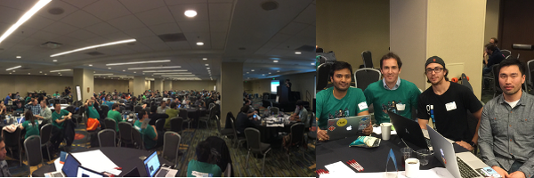
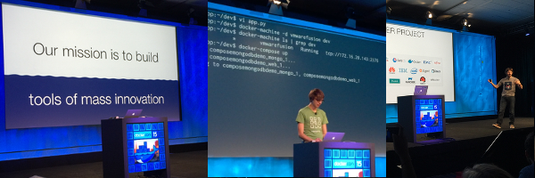
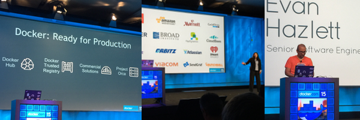
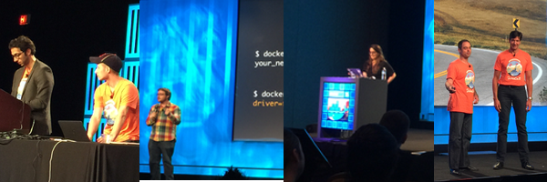
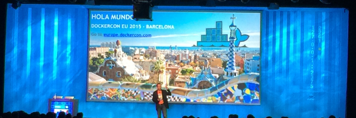

# DockerCon 2015 - La grande messe de Docker


Les 22 et 23 juin derniers s'est déroulée à San Francisco la DockerCon. Nous étions invités en tant que gagnants du Docker Hackathon de décembre et nous n'avons pas été déçus : ambiance joviale, talks de qualité et grandes annonces ont rendu cet evenement exceptionnel.

## DockerCon Hackathon



Comme le veut la tradition, le week-end qui précède la DockerCon se déroule un Hackathon : une compétition ouverte à tout développeur qui aurait envie de se lancer, en à peine 24h, dans le développement d'un nouveau projet autour de Docker. 

250 développeurs étaient au rendez-vous et une quarantaine de projets ont été soumis. En voici quelques-uns que nous avons particulièrement apprécié :

* [Docker for iOS app dev](https://github.com/jkingyens/dockerthon) par [Jeff Kingyens](https://twitter.com/jkingyens): une application node.js qui implémente l'API Docker pour le build et run d'applications iOS
* [libsecurity](https://github.com/advanderveer/libsecurity) par [Ad Van Der Veer](https://twitter.com/advanderveer), [Amir Jerbi](https://twitter.com/jerbia), [Peter Rossbach](https://twitter.com/PRossbach), [Meir Wahnon](https://twitter.com/meirwah), [Daniel Sachse](https://github.com/w0mbat) et [Greg Deed](https://github.com/tegbiz) : Un systeme de distribution massive de patch de sécurité pour des conteneurs distribués
* [Lightning Kite](https://github.com/fsoppelsa/kitematic) par [Fabrizio](https://twitter.com/f_soppelsa), [Toni](https://www.linkedin.com/pub/antoni-segura-puimedon/21/134/28a), Tim, [Iqbal](https://twitter.com/iqbalmohomed), Jochen, and Terry : une extension de Kitematic pour le support de plusieurs provider via docker-machine (e.g. Kitematic on steroids
* [Distributed Computing Platform based on Rancher](https://github.com/ipernet/docker-hackathon-2015) par l'équipe de [CommitStrip](http://www.commitstrip.com/en/about/) ([@ipernet](https://twitter.com/ipernet/) et [@ThomasGX](https://twitter.com/ThomasGX/)) : calcul distribué avec Docker et Rancher

[Le projet](https://github.com/thedanfernandez/DockerCortanaClient) qui a remporté le premier prix est un client Docker vocal pour [Cortana](https://fr.wikipedia.org/wiki/Cortana_(Microsoft), le "Siri" de Microsoft, développé par [@HaishiBai2010](https://twitter.com/HaishiBai2010) et [@danielfe](https://twitter.com/danielfe).

Quand à nous, eh bien nous avons participé encore une fois avec le projet [the Phedds](https://github.com/mjbright/thephedds/): the Phenomenal Docker Demos. Une console web pour réaliser des démo Docker grandioses. Un shell contourné par 3 quadrants qui réprésentent de maniére graphique les conteneurs, les relations et le resources consommées. L'idée de ce projet est de [Mike](https://twitter.com/mjbright) et les autres membres de l'équipe sont [Ryan](https://twitter.com/iamnayr), [Kalyan](https://twitter.com/kalyathatikonda), [Zorigt](https://twitter.com/zorig) et Murali.

En participant à un hackthon on peut etre sur d'une chose : un t-shirt nous sera offert. Et celui-ci était exceptionnel :


Il a été réalisés par les français de CommitStrip qui ont aussi participé à l'hackathon : la classe ! Chez Zenika nous sommes des grands de leur [strip](http://www.commitstrip.com/fr/) et chez Docker [ça doit être la même chose](https://www.youtube.com/watch?v=cRczhEvSH2A)

## Les nouveautés de la keynote : jour 1



C'est Ben Golub, le CEO de Docker, le premier à monter sur scène. Après quelques remerciements il passe la parole au CTO Solomon Hykes qui commence par rappeler la mission de Docker :

**Our mission is to build tools for mass innovation**

Le discours de Solomon est clair et convaincant. Le logiciel est le moyen plus puissant aujourd'hui pour innover. Et Docker veut simplifier au maximum le développement et la pubblication de logiciel. Les quattres objectifs que Docker se donne pour les prochaines années en découlent: 

1. Reinvent the developer toolbox
2. Build better plumbings 
3. Open Standards
4. Help Organisations solve real world problems

Les annonces qui suivent au cours de cette keynote addressent les trois permiers objectifs. Le quatrième sera le sujet de la deuxième journée.

### Docker network et les nouvelles versions de machine, compose et swarm

Le premier jour de la DockerCon coincide avec la release de la version 1.7 de Docker. La nouveauté plus importante de cette version est l'integration dans le engine de [libnetwork](https://github.com/docker/libnetwork), le nouveau module réseau. Cela rend plus flexible la configuration réseau (grace à un systeme de plugin que nous verrons plus tard) mais surtout le support de configurations multihost. C'est a dire qu'il sera possible établir des liens, (les *links*), entre conteneurs sur des hosts distants. Cette dernière fonctionalitée n'est pas livrée avec la version 1.7 mais est disponible uniquement sur [le channel experimental ](https://experimental.docker.com/).


Machine, compose et swarm, les outils de orchestration de Docker, [ont aussi été mis à jour pour la DockerCon](http://blog.docker.com/2015/06/compose-1-3-swarm-0-3-machine-0-3/). Considérés jusqu'à aujourd'hui trop ~jeunes~ pour êtres utilisés en production, pour cette release il y a eu une stabilisation du code et pas de nouvelle features.

La seules nouvautés majeures concerne swarm : l'integration avec mesos (i.e. la possibilité de deployer les conteneurs dans un cluster mesos en passant par swarm) et l'exploitation du nouveau module de networking de l'engine Docker (i.e. la possibilité de faire communiquer conteneurs qui se trouvent des noeuds différents).

### Docker plugins

Et on arrive à une des annonces plus attendues : les plugins pour Docker. Annoncés à la [fin de 2014](https://clusterhq.com/2014/12/08/docker-extensions/), ces point d'extension pour le engine Docker voient le jour aujourd'hui mais uniquement dans le channel experimental. 

Pour l'instant deux types de plugins ont été présentés :

* *Network* *plugins*: extensions pour connecter des containers qui sont sur des machines ou des réseaux distants
* *Volume* *plugins*: extensions pour persister les volumes des conteneurs

Les autres typologies de plugin disponibles sont scheduler et service discovery. D'autres seront bientôt livrées.

Il existe déjà des premiers exemples de plugins. [Flocker](http://clusterhq.com/docker-plugin) pour les volumes et [Weave](http://blog.weave.works/2015/06/22/weave-as-a-docker-network-plugin/), [Project Calico](http://www.projectcalico.org/calico-docker-1-7-libnetwork/), [Nuage Networks](http://www.nuagenetworks.net/libnetwork-is-license-to-hyper-scale-for-docker-and-sdn/), [Cisco](http://blogs.cisco.com/datacenter/docker-and-the-rise-of-microservices), [VMware](http://blogs.vmware.com/networkvirtualization/2015/06/vmware-docker-networking.html), Microsoft et [Midokura](http://blog.midonet.org/docker-networking-midonet/) pour le networking.

### Docker plumbing project et notary

Une grande partie du code de Docker (50%) sert à la géstion de l'infrastructure, ce qu'on appelle **infrastructure plumbing**. Il s'agit de tout ce qui n'est pas fonctionnel à la géstion des conteneurs. 

Plus le projet grandit plus on sent le besoin de séparer la partie infrastructure de la partie conteneurs. Et Solomon a annoncé que Docker s'engage à effectuer cette séparation. Cela commence avec deux projets : runC, auquel est dédié le prochain paragraphe, et notary, un outils pour sécuriser les mises à jour. 

[Notary](https://github.com/docker/notary) se base sur [The Update Framework](http://theupdateframework.com/) pour vérifier l'integrité et la source des artefacts téléchargés sur Internet. Dans l'ésprit du plumbing project, cet outil est séparé de Docker et du Hub et pourrait être réutilisé par d'autres projets. Son utilité ? La vérification des images téléchargées avec un `docker pull` ou du package d'installation de Docker. Notary a été dévoloppé par Diogo Monica et Nathan McCulney, les deux experts sécurité récemment recrutés par Docker et le code est disponible sur [github](https://github.com/docker/notary).

### runC

Mais la première étape du Docker plumbing project consiste à isoler le code pour la géstion des conteneurs : le "container runtime". Et c'est ce que l'équipe a fait avec runC, peut-etre la nouveauté la plus importante de cette conférence : le code qui constitue le noyeau de Docker, libcontainer, est déplacé dans ce nouveau projet qui ne fait pas partie de l'organisation Docker mais du Open Container Project (OCP). Docker a fait donation de son "container runtime" à la OCP, organisation vendor netural, qui est décrite dans quelques lignes.  

Runc est actuellement en phase de développement mais un support multiplateforme (Linux et Windows 10) et multi architecture (x86, Arm, Power, Sparc) est annoncé. Pour plus d'info [une page](http://runc.io/) y est dédiée au projet et le code est disponible sur [github](https://github.com/opencontainers/runc).

### Open Container Format et Open Container Project

L'année dernière, quelques jours avant la DockerCon Europeenne, CoreOS avait présenté un standard ouvert pour la définition du format des images de conteneurs : [appc](https://github.com/appc/spec). Et avait livré en même temps, [rkt](https://github.com/coreos/rkt), un runtime qui implémente ce standard. Plutot qu'un attaque il s'agissait d'une incitation : Docker était dévenu le standard de facto avec un ecosysteme important qui attendait impatiemment la définition d'un standard pour les conteneurs.

La réponse de Docker arrive aujourd'hui avec l'annonce du [Open Container Project](https://www.opencontainers.org/), une coalition de sociétés (entre autres Amazon, CoreOS, Docker, Google, IBM, Mesosphere, Microsoft, Rancher Labs, Red Hat, VMware) unies pour définir un standard pour le format des containers. Ce projet sera maintenu par la Linux Foundation. La rédaction de [la spécification [Open Container Format](https://github.com/opencontainers/specs) est encore en cours. Le premier draft sera pubblié à la fin du mois de juillet.

Au moment où Salomon a fait l'annonce, Alex Polvi, le CEO de CoreOS qui se trouvait au premier rang, s'est levé pou serrer la main à Solomon : la guerre du standard des conteneurs est terminée !


## Les nouveautés de la keynote : jour 2



C'est encore Ben Golub qui prend la parole au début de la matinée. Il rapelle les thèmes du premier jours (Open Standards, Plumbing, Developer Platform) et introduit le thème de cette deuxième journée : Business Solutions. Si la première journée était plus orientée développeurs, la deuxième est pour les clients et les partners. Est-ce que Docker est prêt pour la prod ? La réponse est oui et toutes les annonces de cette matinée sont visées à convaincre tous les clients qui auraient encore des doutes question.

### Une nouvelle version du Docker Hub

Le Docker Hub a été lancé il y a à peine un an et compte déjà 240K utilisateurs. A servi plus de 500M pull d'images Docker. Il est devenu un répository pour images privés mais surtout d'images officielles. 

Mais le Docker Hub est aussi utilisé comme outil pour l'integration continue : on peut builder une application (en utilisant l'instruction RUN dans un container) ou la déployer (avec le système de hook du Hub).

Bref l'architecture et la capacité prévue our le Hub il y a un an ne sont plus suffisantes et un refactoring de la stack technique a été obligatoire. 

D'où le lancement de [cette nouvelle version](https://hub-beta.docker.com/), encore en béta, les jours de la conférence. A noter que [la vielle version](https://hub.docker.com) est toujours opérationelle : on peut tester la béta si on veut ou bien continuer à utiliser l'ancienne version.

### Docker Trusted Registry et les solutions commerciales

Beaucoup de clients ne peuvent pas utiliser le Docker Hub pour des contraintes de sécurité. Pour eux et pour tous ceux qui préfèrent avoir un Hub dédié uniquement à leurs images, Docker a présenté aujourd'hui un nouveau produit : le Docker Trusted Registry.

Il s'agit d'un registry Docker qui peut etre déployé sur un serveur dans notre réseau, derrière un firewall, en s'intègrant avec LDAP et Active Directory.

### Project Orca

Le projet Orca développée par Evan Hazlett nait des scendres de [Shipyard](https://github.com/shipyard/shipyard). C'est un outil dédié aux ops pour le monitoring et la géstion des conteneurs déployés en production. Parmi les différentes carcteristiques nous avons noté :

* L'intègration avec des services pour l'authentication des users
* Les détails des layer qui constituent une image
* L'intégration avec swarm pour gérer tous les noeuds d'un meme cluster

Mais la feature plus interessante est la notion de stack de conteneurs. Orca permet de définir des groupes de conteneurs interconnéctés comme on défini une les services avec docker-compose : à l'aide d'un fichier yml.

Le repository github du projet Orca n'est pas public (pour l'instant). Pour avoir plus d'info on peut remplir [ce formulaire](https://docs.google.com/forms/d/18fTeWfbHelGoB0Npx8MAV_44M3euw9WZHFKIFZPkT2s/viewform). 

### Docker commercial solutions

Un service de TMA est une des demandes récurrents des clients qui souhaient déployer Docker en production. Pour répondre Docker proposera à partir d'aujourd'hui un service de experts disponibles pour répondere aux questions des utilisateurs ainsi que la maintenance du Docker engine pendant un an à partir de la date de releae et l'acces à des Docker registry privés.

Plus d'information sont disponibles à la page : https://docker.com/solutions

## Les talks



A la fois le premier et le deuxième jours, après la keynote, ont eu lieu une série de talk qui traitaient de manière plus détailléee les sujets abordés à la keynote. C'ètait l'occasion de découvrir des REX et de assister à des démos parfois spéctaculaires. 

Nous avons séléctionnéEs les 4 talks qui nous ont plus impressioné ci-dessous :
 

### Arnaud Porterie et Mike Cosby - Docker Engine

Sans aucun doute la démo la plus cool de toute la conférence ! Le tour du monde d'un serveur Quake (dans un conteneur) a coups de [checkpoint/restore](http://criu.org/Docker) avec [runC](http://runc.io/) sans jamais arreter de jouer.

Pour plus d'info sur les détails techniques de cette démo Saied Kazemi, un ingénieur de Google, a écrit [un article très interessant](http://blog.kubernetes.io/2015/07/how-did-quake-demo-from-dockercon-work.html).

En plus de la démo, Mike te Arnaud ont parlé du futur du Docker Engine et de runC, sujets déjà introduits par Solomon lors de la keynote, détaillés un peu plus dans ce cas. 

En tout cas [check out the video](https://www.youtube.com/watch?v=mL9AFkJJAq0&app=desktop), ça vaut le coup!

### Luke Marsden (ClusterHQ), Alexis Richardson (Weaveworks), Jeff Lindsay (Glitter Labs) - Docker plugins

Les extensions viennent d'etre annoncées à la keynote et ce talk en montre deux implémentations : le volume plugin développé par ClusterHQ (Flocker) et le networking plugin développé par Weaveworks. Le tout expliqué à l'aide d'[une démo vraiment bien faite](https://www.youtube.com/watch?v=ri5mzIsbsY8). 

Le mechanisme d'extension peut-^etre simplifié ainsi : les plugins s'enregistrent auprès de l'engine Docker pour etre notifiés a l'occasion de certains évenments. A chaque notification est associé un hook bloquant. La communication entre les plugins et le engine se fait avec une api REST.

Ci dessous un exemple d'utlisation des plugins weave (networking) et flocker (volumes)

```
docker run --publish-service=service.network.weave
              --volume-driver=flocker

```

Tous ce qui a été présenté est déjà disponible pour etres testé (sur le experimental channel de Docker). Il existe [une page github](https://plugins-demo-2015.github.io/) qui explique dans le détails les instructions d'utilisation.

### Jessie Frazelle - Contain yourself

Jessie est une développeuse brillante qui travaille pour la Core Team Docker. Elle est aussi très active sur [twitter](https://twitter.com/frazelledazzell) et à travers son [blog](https://blog.jessfraz.com/). Et c'est à un de ses blog posts que s'inspire ce talk : [Docker Containers on the Desktop](https://blog.jessfraz.com/post/docker-containers-on-the-desktop/) ou comment utiliser Docker de façon non conventionelle. Jessica nous a montré comment elle a réussi a fair tourner tous les outils de son laptop dans des images Docker : client mail (mutt), IRC (Irssi), client twitter (Rainbowstream), browser (chrome), skype (avec appel en direct à Arnaud Porterie ;-)), Spotify etc. Elle a énuméré toutes les astuces pour accéder au serveur X11, à la carte son et au micro à partir d'un conteneur. Parmi toutes ces applications, la plus difficile a executer dans un conteneur a été Virtual Box : il a fallu utiliser récompiler le driver `/etc/init.d/vboxdrv`.

Pour terminer Jessie nous a parlé du [projet Tor](https://www.torproject.org/), un ensemple de outils pour l'anonymisation sur Internet, et de comment utiliser Docker pour rendre anonyme tout le flux TCP sortant de notre interface réseau. Les détails de cette démo sont également décrits dans un blog posts : [How to Route Traffic through a Tor Docker container](https://blog.jessfraz.com/post/routing-traffic-through-tor-docker-container/).

Bref ce talk était encore une fois très interessant et [la video est déjà disponible online](https://www.youtube.com/watch?v=1qlLUf7KtAw).

### Mark Russinovich - Docker on Windows

La collaboration entre Microsoft et Docker est de plus en plus étroite et Mark Russinovich, le CTO de Microsoft Azure, était là pour en témoigner.

Il met tout de suite en clair que les Microsoft est la société qui a le plus contribué au code de Docker entre mars et juin 2015. Cela s'éxplique par les pull request importantes qui ont été faites par des développeurs du groupe de Redmond : le client natif pour Windows et le support de Windows 10 pour le Docker engine.

Mais Mark a surtout fait un certain nombre de démo qui montrent comment les produits Microsoft sont désormais intégrés avec Docker :

* Le deploiement d'une application .NET dans un conteneur Docker distant (dans u host Ubuntu) en utilisant Visual Studio sur Windows.
* L'integration de compose et swarm avec Visual Studio Online
* Le provisioning d'une instance Azure du nouveau Docker Trusted Registry
* La coloration syntaxique et l'autocompletion des fichiers yml de docker-compose avec Visual Studio Code sur MacOS et le build, run d'un conteneur distant, cette fois-ci sur un serveur Windows 10.

Beaucoup de nouveautés donc, certaines déjà disponibles et d'autres qui le seront bientôt avec la GA de Windows 10 le 29 juillet prochain. On peut en tout cas affirmer que le message transmis par le CEO Nadella lors de la dernière conférence Build est toujours d'actualité : Microsoft ❤️ Linux !


## Rendez-vous à Barcelone



Et nous voici arrivés à la fin de ce compte rendu. La conférence s'est terminéee avec Ben Golub qui a révelé lieu et date de la prochaine DockerCon : au CCIB de Barcelone le 16 et 17 Novembre prochains. Et nous ne pourrons pas manquer ;-)


