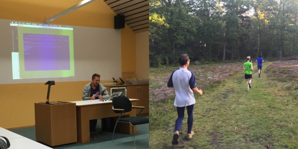

# SoCraTes Conference 2015

SoCraTes, la conférence majeure de la communauté craftsmanship en Europe, a eu lieu du 27 au 30 aout, dans la campagne allemande près de Hambourg. Nous avons eu le plaisir d'y assister et allons vous le raconter dans cet article.

## World Café (jeudi)

La conférence commence officiellement le jeudi soir à 19h avec un World Café. Le but de cette session est double : 

* Briser la glace entre les participants
* Faire émerger les idées et le attentes des participants

Le déroulement : les 180 participants sont repartis sur une vingtaine de tables. Chaque table discute de ce que chacun veut apporter à cette édition de SoCraTes. Toutes les idées sont notées sur une grande nappe en papier. Au bout de 20 minutes tous les participants sont invités à changer de table. L'historique des discussions de la table est assuré par une personne qui, contrairement à tous les autres, ne va jamais se déplacer.

Au bout de 3 rondes les notes sont récupérées par les facilitateurs et affichées dans la salle principale pour inspirer les sujets des sessions qui auront lieu les jours suivants. 

Exemples des sujets qui ont été discutés à nos tables : techniques de tests (BDD, TDD), Infrastructure as Code (Docker, Ansible), soft skills, programmation fonctionnelle, caractéristiques des bonnes entreprises, gamification, pair programming, peer review, vim. Il s'agissait, nous le découvrirons par la suite, que d'un petit aperçu des sujets qui seront proposés le long des deux jours suivants.

## Open Space (vendredi et samedi)

Vendredi démarre le [Open Space](https://fr.wikipedia.org/wiki/M%C3%A9thodologie_Forum_Ouvert). Pour ceux qui se ne savent pas de quoi il s'agit nous utiliseront les mots du facilitateur [Pierluigi Pugliese](http://blog.connexxo.com/) pour le résumer :
 
> Quand on assiste à une conférence les échanges plus intéressants se font souvent à l'occasion d'une pause-café. Un Open Space est une conférence qui tiens compte de ça et qui ressemble à une pause café qui dure deux jours.

Il n'y a pas de agenda prévu avant le début de la conférence : l'organisation se fait au jour le jour le matin. Ceux qui veulent apporter quelque chose (proposer un talk, poser des questions, parler de leur projets) n'auront qu'à noter leur sujet sur un post-it et le présenter rapidement aux autres participants.

Voici la liste des sujets auxquels nous avons assistés et que nous avons trouvés intéressants :

#### Les sujets de la première journée

* Be Cat-matic ([@pawelduda](https://twitter.com/pawelduda/)): arrêtons d'être Dog-matic ! Durant cette session, nous avons pris les sujets qui nous tiennent le plus à cœur et essayé de trouver les cas où il ne faut pas les utiliser.
* Javascript Koans ([@carlosble](https://twitter.com/carlosble/)): pendant une heure, nous avons ouverts no chakras à javascript en plongeant dans du code aux effets de bord étranges.
* Property based testing ([@magicmonty](https://twitter.com/magicmonty)): un échange sur les techniques pour générer automatiquement les paramètres pour nos tests
* Containers patterns ([@luebken](https://twitter.com/luebken/)): très intéressant catalogue de cas utilisations des conteneurs. Docker mais pas que.
* What the VIM ([@janernsting](https://twitter.com/janernsting)): parce qu'un bon éditeur devient un très bon éditeur quand il est bien configuré, nous avons échangés sur les plugins et autres astuces que nous connaissons sur vim (ex. comment faire tourner vim dans emacs)
* Remote pair-programming ((@hschmeisky](https://twitter.com/hschmeisky) et [rradczewski](https://twitter.com/rradczewski)): présentation de deux outils pour faire du pair programming à distance : saros et tmate. Le premier est un plugin eclipse et (@hschmeisky](https://twitter.com/hschmeisky) est contributeur. Le deuxième est un fork de tmux et [rradczewski](https://twitter.com/rradczewski) l'utilise en mission.
* Show me your test pyramid ([@thbrunzendorf](https://twitter.com/thbrunzendorf)): nous connaissons tous le schéma de la pyramide de tests et sont anti-pattern connu sous le nom de cône de glace, mais d'autres «pyramides» de tests existent.

#### Les sujets de la deuxième journée

* Haskell Test Driven Learning ([@xdetant](https://twitter.com/xdetant)): Xavier a eu le plaisir de présenter son expérience d'apprentissage d'un nouveau langage grâce à TDD. Il s'est appuyé sur Haskell pour cela.
* Your code as a crime scene ([@StefanSeegers](https://twitter.com/StefanSeegers)) : note de lecture du livre omonyme, quelques idées pour dénicher les problèmes de notre code en analysant les commits dans notre répo de code source.
* NixOS ([@tpflug](https://twitter.com/tpflug/)) : les qualités (immutabilité et mises à jour très fréquentes) et les limites (courbe d'apprentissage longue) du package manager de NixOS que [@tpflug](https://twitter.com/tpflug/) utilise depuis plus d'un an. 
* Open Salary ([@luebken](https://twitter.com/luebken/)) : chez Giant Swarm ils ont décidé de ne rien cacher, tous les employés connaissent les salaires des autres et le salaire de chaque nouveau recruté est discuté ouvertement.
* TDD does not always lead to good design ([@sandromancuso](https://twitter.com/sandromancuso/)) : ni le TDD classique ni l'approche outside-in sont des outils permettent de concevoir des architectures complexes. Dans certains cas on ne peut pas éviter de faire un travail de concéption en amont.
* Git Internals ([@chr1shaefn3r](https://twitter.com/chr1shaefn3r)) : content driven storage et ce qui se cache dans le folder objects (blob, tree, commit, tag)

## Workshops (dimanche)

Le dimanche il n'y a pas de Open Space. C'est le jour des workshops : code retreat, introduction à la programmation fonctionelle, TDD avec les google spreadsheet etc...

Nous avons choisi de participer à un [Extreme Startup](https://github.com/rchatley/extreme_startup) organisé par [@w3ltraumpirat](https://twitter.com/w3ltraumpirat). Il s'agit d'un jeu ou nous devons développer un serveur http qui répond à des questions allant de «quelle est la couleur d'une banane?» à «quel était la monnaie utilisé en espagne avant l'Euro?» en passant par «quel est la 9ième valeur de la suite de fibonnaci?». Chaque bonne réponse rapporte des point et une fausse réponse en enlève.

Nous nous sommes régulièrement arrêtés afin de discuter sur ce qui marche et ce qui ne marche pas. Ce fût une expérience très enrichissante.

## Les autres activités

SoCraTes n'est pas que des talks est des workshop. Voici une liste, non exhaustives, des activités *secondaires* auxquelles nous avons participé :

* Running : rendez-vous tous les matins à 7h pour parcourir 5km dans la forêt de Soltau tout en discutant craftsmanship.
* Jeux de société : le soir après diner les gamers se retrouvaient dans une salle pour jouer à hanabi ou exploding kittens.
* Crappy Tools : un paper board était affiché dans la grande salle et nous étions tous invités à marquer les outils que nous détestons.
* Power Point Karaoke : chaque concurant doit simuler un talk en utilisant des slides pris au hasard sur Internet. Pour rendre le tout encore plus hilarant le sujet du talk et les slides n'ont rien à voir.
* Plusieurs Coding Dojo : Randori (Diamond), TDD avec un Commodore 64, Gilded Rose, intro à Ruby.

## Conclusion

Si cet article vous a mis l'eau à la bouche et bien sachez que dans quelques semaines aura lieu [la première édition française de SoCraTes](https://socrates-fr.github.io/) !
