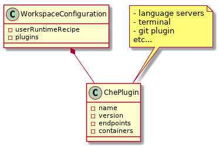
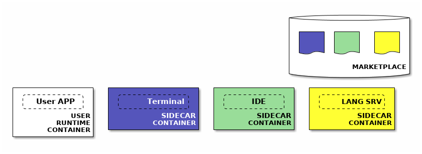
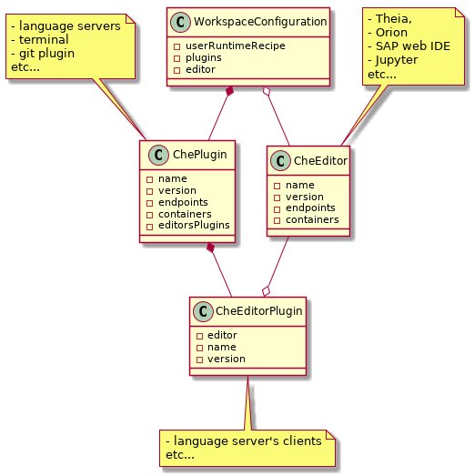

# The new superpowers of Che Workspaces


This article is about the changes we are currently introducing to Che workspace model. The workspace model is the abstraction that describes how Linux containers are leveraged in Che to provision users development environments.

Che is an extremely active Open Source project and has evolved significantly in the last few years ([Kubernetes](https://www.eclipse.org/che/docs/kubernetes-multi-user.html) and [OpenShift](https://www.eclipse.org/che/docs/openshift-multi-user.html) support are some example of this incredible evolution). In the meantime the workspace model has remained almost unchanged and the time has come to rethink the architecture of the workspace engine in order to make it cloud-native and easier to extend. That's what we call **Workspace.next**.

## Workspace.next Goals

Details about the architectural changes that will be introduced with Workspace.next can be found in [this GitHub issue](https://github.com/eclipse/che/issues/8265). The most significant ones are:

- Running IDE tooling and plugins in separated sidecar containers
- Integrating Che with third party applications catalogs as [OpenShift Service Catalog](https://docs.openshift.org/latest/architecture/service_catalog/index.html) and [Kubeapps](https://kubeapps.com/)
- Creating workspaces from a Kubernetes/OpenShift YAML, a Composefile or even a Dockerfile
- Improving multi-container runtimes support and microservices debugging
- Implementing a new CLI to manage workspaces

The first one of these changes (*Running IDE tooling and plugins in separated sidecars containers*) is also a prerequisite for the rest of Workspace.next changes and we are going to describe it in greater detail in the rest of this article.

## Using sidecar containers

In the old workspace model we ran multiple services in one unique container. When a workspace was started Che bootstrapped a bunch of services (wsagent, terminal, language servers, build tools, the runtime application) all in the same user defined container. This approach has the merit to be effective but has a few drawbacks:

- We are breaking the containers promise: the image used to run the application in Che (the one that the developer will test) is not the same one that will be used in production.
- The IDE tooling is packaged and distributed as a tar file instead of being built as container images.
- Limiting the resources (CPU/RAM) available for the application will limit the IDE tooling too

To fix that we need to run Che plugins and tooling in separate containers (sidecars) avoiding any modification to users defined containers (user runtime environments).


## Workspace.next first step

A few weeks ago [Alex](https://twitter.com/garagatyi) has merged [the first Workspace.next Pull Request](https://github.com/eclipse/che/pull/9774). That made it possible to run user defined runtimes and Che tooling in separate containers (here is a [short demo](https://drive.google.com/file/d/1x8jKFdHKilwD8r123i-quKueUMs5tbBO/view?usp=sharing)). To check it out (beware that it's still a work in progress) you will need to run Che on Kubernetes and:

1. Start a Che workspace based on the following kubernetes recipe:
    ```json

    ```
2. Start the feature server
    ```bash

    ```
3. Stop the workspace and modify it using Che API to add the following attribute:
    ```json
    "features": "theia", "git", "jdt","maven","terminal"
    ```
4. Restart the workspace

When the workspace is run for the second time you should see that multiple containers are run. One for each IDE tool ("feature"): tools are running inside sidecar containers!

## Integration with newest Che developments: Theia and the marketplace

Workspace.next is just one amongst many major changes that we will be introducing in the next months. Some equally important new features include the replacement of Orion with Theia as the default code editor and the use of a plugin marketplace to find and download Che extensions. In this section we are going to look at how these new features will be integrated within Worksapce.next model.

### Simplifying the model

With the first Workspace.next step we have introduced the concepts of "Feature" (a bundle of Che extensions) and "Service" (a Che extension). This "two layer" based model is over-complicated to begin with and we have decided to get rid of the "Feature" abstraction (there won't be bundles of plugins, at least at the beginning). Another change has been to rename "Services" into "Che Plugins":



### Getting Che plugins from a Marketplace

The description of a Che plugin will be stored as a YAML file (with attributes such as the container image of the Che plugin, its endpoint, health check etc...).

The YAML files will be published in a marketplace. When loading a plugin within a workspace Che will fetch the plugin description from a marketplace.



### How Workspace.next will run Theia (as well as other editors) and its plugins

Another change that will be introduced is the concept of "Che Editor". This is a particular kind of "Che plugin" that has (sub-)plugins and serves the workspace UI. This means that Theia (or another "Che Editor" like Orion or Jupyter) will run as a sidecar container as any Che plugin.

A Che workspace can have one "Che Editor" or none at all. A Che workplace with no "Che Editor" will be an interesting use case: the IDE tooling API (that provides languages support etc...) will still be available and could be used from classic desktop IDEs (think about VIM, Eclipse, Emacs).

As mentioned "Che Editors" may have their plugins. These are not to be confused with Che plugins and are not managed by Che itself: Che will only manage a list of Editor Plugins for every Workspace. At workspace bootstrap the Editor will be requested to load them.

The list of required Editor Plugins is an attribute of a Che plugin. If a Che plugin (e.g. jdt.ls) needs an Editor Plugin (e.g. Theia jdt.ls client) it should be listed in the Che Plugin definition (the YAML file).

Here is a simplified schema of the relations between Che Plugin and Che Editor:



## Conclusions

